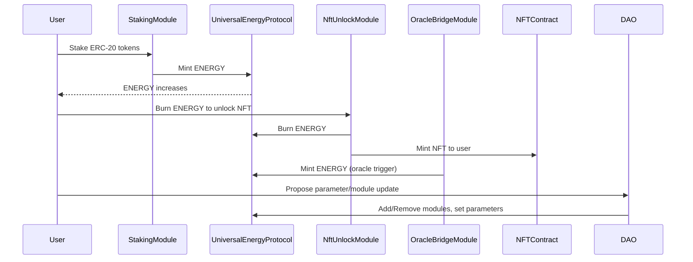

# Universal Energy Protocol — Architecture

**This architecture is designed for a single, future-mergeable DAO, with full support for both OCOS and S470SHI communities.**

---

## 1. Introduction

UniversalEnergyProtocol (UEP) establishes a robust, DAO-first, modular energy and reputation system for Web3 platforms.  
All protocol logic, module flows, and governance actions are designed for maximal security, transparency, and future unification.

---

## 2. Core Architecture

### 2.1 UniversalEnergyProtocol.sol (Core Engine)

- **ERC-20 compatible ENERGY token** (only minted/burned by DAO-approved modules)
- **Reputation Layer:** Tracks user merit, growth, and contribution
- **DAO Governance:** All permissions, upgrades, and module additions/removals controlled by DAO
- **Events:** All state changes, mint/burn, transfers, and governance actions are logged on-chain

### 2.2 Module System

#### a. StakingModule.sol

- Stake any ERC-20 to earn ENERGY rewards (rate/period set by DAO)
- Early unstake penalized, claims tracked, all actions auditable

#### b. NftUnlockModule.sol

- Burn ENERGY to unlock or mint NFTs (ERC-721 or SBT)
- Tracks every unlock event, unlocker address, and NFT tokenId
- Unlock pricing fully DAO-controlled

#### c. OracleBridgeModule.sol

- Bridges ENERGY rewards with off-chain, cross-chain, or oracle events
- Only DAO-specified oracle or backend contract can trigger rewards
- Prevents replay and abuse; all events are logged

#### d. IModule.sol (Interface)

- All modules **must implement** `onEnergyMint` and `onEnergyBurn`
- Ensures modular, plug-and-play, DAO-permissioned integration

---

## 3. DAO Governance Layer

- **DAO** (multisig or contract) is the sole authority for all upgrades, parameters, and module registration
- Only DAO can:
    - Add or remove modules
    - Update staking reward rates, NFT unlock prices, oracle reward rates
    - Transfer ownership and governance
    - Trigger emergency pause (recommended for mainnet)
- All actions are on-chain and fully auditable

---

## 4. Protocol Lifecycle

1. **Initialization:** OCOS and S470SHI DAOs deploy parallel UniversalEnergyProtocol instances with their own modules, parameters, and DAO logic.
2. **Module Era:** Each DAO governs ENERGY mint/burn, reputation, staking, NFTs, and oracle triggers independently.
3. **Future Merge:** When agreed by governance, DAOs can merge all balances, reputations, and modules into a single, unified protocol and DAO — ensuring all histories are cryptographically linked and transparent.

---

## 5. Data & Event Flows

---

## 6. Security Principles

- **No public mint/burn:** Only DAO-registered modules can call ENERGY mint/burn
- **Full event logs:** All actions, upgrades, and user events are on-chain
- **Replay/abuse protection:** Modules implement strict controls on user and oracle actions
- **DAO is sovereign:** Only governance can modify core logic or state

---

## 7. Extensibility & Future-Readiness

- Any new module (vesting, reward, airdrop, cross-chain bridge, advanced NFTs, DeFi) can be added with a single DAO vote and IModule interface compliance
- Designed for clean merging: future-proof for multi-DAO, multi-network systems

---

## 8. Glossary

- **ENERGY:** Core reputation+utility token, minted/burned by modules, non-publicly accessible
- **Module:** Smart contract (staking, NFT, oracle) permissioned by DAO and implementing IModule
- **Reputation:** User’s merit and historical contribution, tracked on-chain
- **DAO:** On-chain governance, controlling all protocol logic and upgrades

---

For further protocol details, see [`README.md`](../README.md), [`SECURITY.md`](../SECURITY.md), and [s470shi.org](https://s470shi.org).

---
